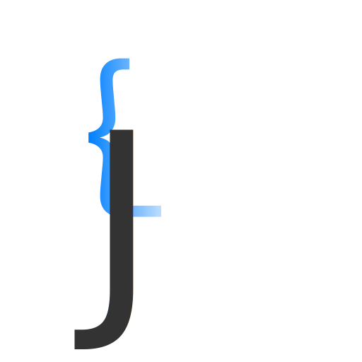

## Hi there 👋. </h2>
## I'm Jordi, an always evolving Full Stack Developer.</h2>

At work I use **Vite** , **React**  and **Laravel** 

At home I also use **Vite**  and **React** , but for backend I'm liking **AdonisJS** 

I write about my projects on .

Soon, on the blog I'm building.

<!--
**jolle11/jolle11** is a ✨ _special_ ✨ repository because its `README.md` (this file) appears on your GitHub profile.

Here are some ideas to get you started:

- 🔭 I’m currently working on ...
- 🌱 I’m currently learning ...
- 👯 I’m looking to collaborate on ...
- 🤔 I’m looking for help with ...
- 💬 Ask me about ...
- 📫 How to reach me: ...
- 😄 Pronouns: ...
- ⚡ Fun fact: ...
-->
